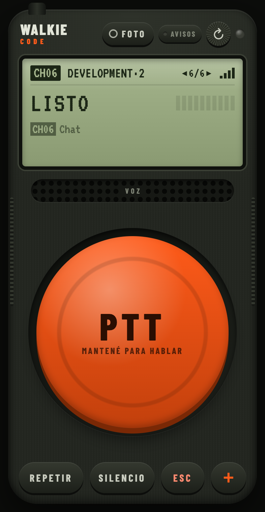

# Walkie-Code

**A push-to-talk walkie-talkie for Claude Code.** Hold a big orange button on your iPhone, talk, let go — your words are typed into the Claude Code session running in iTerm2 on your Mac, and Claude's answer is read back to you on the phone.

[Leer en español](README.es.md)

<p align="center"></p>

Everything runs on your own machines. Speech-to-text runs locally with Whisper, text-to-speech with macOS `say`, and the phone reaches the Mac through your private Tailscale network. Nothing leaves your network except what Claude Code already sends.

> Walkie-Code is an independent community project. It is not affiliated with or endorsed by Anthropic.

## Features

- **Real push-to-talk.** Hold, wait for the beep, speak, release. No "send" button.
- **Channels.** Every iTerm2 session running Claude Code is a channel. Swipe the screen, say "canal superprecio", or use the Dynamic Island track buttons to switch. The tuned tab is painted orange on the Mac with a "📻 CH03" badge.
- **Answers made for listening.** Dictated prompts ask Claude for short, conversational answers; code blocks and tables are announced instead of read. Messages typed on the Mac are not affected.
- **Recap.** On open, and on every channel switch, the screen shows the last prompt and the last answer of that session, even if they were typed on the Mac. REPETIR reads it aloud.
- **Permissions by voice.** When Claude asks for permission you hear it, and "sí" or "no" answers the menu.
- **Notifications.** Web Push when the phone is locked, alerts when a long task finishes in any channel, and a warning when Claude hits its usage limit (with the reset time), so the walkie never waits forever.
- **Photos.** Snap a picture of a bug or a design and send it with your next message.
- **Open Claude anywhere.** Pick a folder from the phone and a new iTerm2 window starts Claude Code there.
- **Voices.** Choose any installed macOS voice and speed, including enhanced and premium ones.

The UI is in Spanish (Rioplatense) today. Translations are very welcome — see [CONTRIBUTING.md](CONTRIBUTING.md).

## How it works

```
iPhone (web app) ──audio──▶ server.js ──▶ whisper-server (speech to text, local)
                                      └──▶ iTerm2 (AppleScript): types into the tuned session + Enter
Claude Code ──hooks──▶ server.js ──say──▶ audio ──SSE──▶ iPhone
                                 └──Web Push──▶ locked iPhone
```

- A small Node.js server (no npm dependencies) runs on the Mac as a `launchd` agent and listens on `127.0.0.1` only.
- `tailscale serve` exposes it over HTTPS inside your tailnet. Safari only allows microphone access over HTTPS.
- Claude Code [hooks](https://code.claude.com/docs/en/hooks) (`UserPromptSubmit`, `Stop`, `PermissionRequest`, `StopFailure`) tell the server when a turn starts, ends, needs permission or fails.
- The phone app is a plain web app you add to the Home Screen: no Xcode, no App Store.

## Requirements

- macOS with [iTerm2](https://iterm2.com) and Node.js 20+
- [Claude Code](https://code.claude.com)
- `brew install whisper-cpp ffmpeg`
- A Whisper model. We use `ggml-large-v3-turbo-q5_0.bin` (~550 MB), which runs well on Apple Silicon.
- [Tailscale](https://tailscale.com) on the Mac and on the iPhone, with MagicDNS and HTTPS certificates enabled in the admin console
- iOS 16.4+ for push notifications

## Setup

```sh
git clone https://github.com/bunkerapps/walkie-code.git
cd walkie-code

# 1. Whisper model
mkdir -p ~/.walkie-code/models
curl -L -o ~/.walkie-code/models/ggml-large-v3-turbo-q5_0.bin \
  https://huggingface.co/ggerganov/whisper.cpp/resolve/main/ggml-large-v3-turbo-q5_0.bin

# 2. Claude Code hooks (adds its entries to ~/.claude/settings.json, keeps yours, makes a backup)
node scripts/install-hooks.js

# 3. Run the server as a launchd agent (starts at login, restarts on crash)
scripts/service.sh install

# 4. Publish it inside your tailnet over HTTPS
tailscale serve --bg 8787
```

Then open `https://<your-mac>.<your-tailnet>.ts.net/?t=<token>` in Safari on the iPhone and use **Share › Add to Home Screen**. The token is in `~/.walkie-code/config.json`.

On first use, macOS asks for **Automation** permission so `node` can control iTerm2.

Useful commands: `scripts/service.sh restart | status | logs | uninstall` and `node scripts/install-hooks.js --remove`.

## Configuration

`~/.walkie-code/config.json` (created on first run):

| Key | Default | What it does |
| --- | --- | --- |
| `port` / `whisperPort` | `8787` / `8788` | Local ports of the server and of whisper-server |
| `language` | `es` | Whisper language and the language of the voice list |
| `model` | `~/.walkie-code/models/ggml-large-v3-turbo-q5_0.bin` | Whisper model |
| `whisperPrompt` | programming vocabulary | Words Whisper tends to mishear |
| `voice` / `rate` | `Paulina` / `190` | macOS voice (`say -v '?'`) and words per minute |
| `voiceStyle` | `true` | Ask Claude for listen-friendly answers to dictated prompts |
| `notices` / `notifyAfterSeconds` | `true` / `60` | Alerts from other channels, and the minimum turn length |
| `projectsRoot` | `~/Development` | The only folder tree the phone can open Claude in |
| `names` | `{}` | Custom channel names per folder (set from the phone) |
| `allowedHosts` | `[]` | Extra `Host` names accepted besides localhost and `*.ts.net` |
| `pushSubject` | `https://bunkerapps.net` | VAPID contact (`mailto:` or `https:`) |

**Sounds.** The public sounds are synthesized by `scripts/make-sounds.js`. To use your own without publishing them, drop `ptt.m4a`, `release.m4a` and `rx.m4a` into `~/.walkie-code/sounds/`.

Set `WALKIE_CODE_HOME` to run a second, isolated instance, for example during development.

## Security

Walkie-Code can type into your terminal, so read [SECURITY.md](SECURITY.md) before running it. In short:

- The server binds to `127.0.0.1` and is reachable only through your tailnet. **Never expose it with Tailscale Funnel or any public tunnel.**
- Every API call needs a 128-bit random token, compared in constant time. Requests with a foreign `Host` header are rejected, which protects against DNS rebinding.
- Text is typed only into sessions where Claude Code is running, never into a plain shell, and control characters are stripped.
- Dictated text, Claude's answers and uploaded photos stay on your Mac. The service log in `~/.walkie-code/` contains what you dictate.

## Development

```sh
npm test         # node:test, no dependencies
npm start        # run the server in the foreground
```

See [CONTRIBUTING.md](CONTRIBUTING.md). Please do not test against your real Claude Code sessions: use `WALKIE_CODE_HOME` and a separate iTerm2 window.

## License

[MIT](LICENSE)
